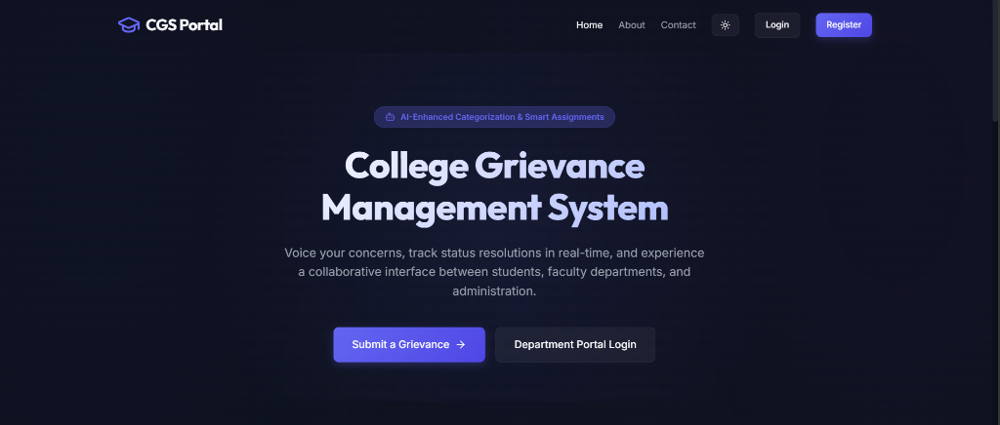
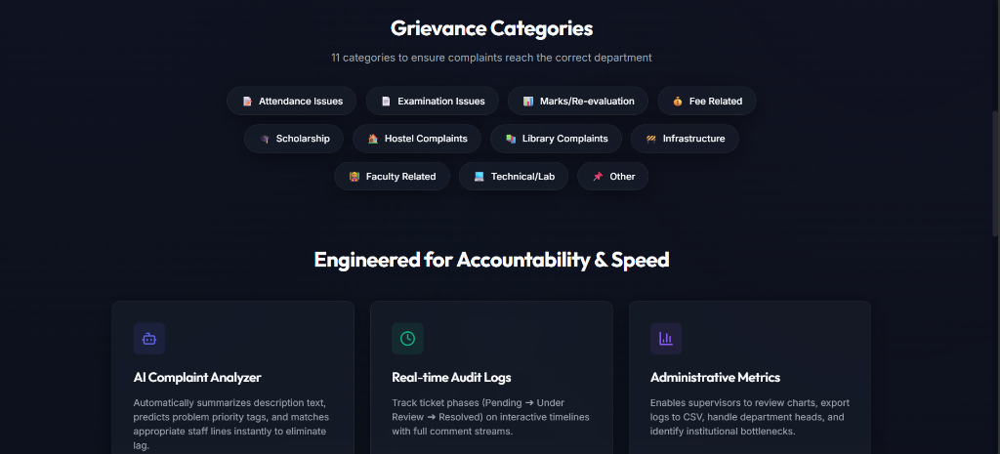

# 🎓 College Grievance Management System (CGMS)

A modern AI-powered **College Grievance Management System (CGMS)** that streamlines the grievance handling process within educational institutions. The system enables students to submit grievances online, track their progress in real time, communicate with faculty, and provide feedback after resolution. Faculty and administrators can efficiently manage, assign, and resolve grievances through secure role-based dashboards.

Built using **React (Vite)**, **Node.js**, **Express.js**, **Supabase (PostgreSQL & Storage)**, and **Google Gemini AI**, this project provides a scalable, secure, and responsive solution for grievance management.

---

## 🚀 Live Demo

**Frontend (Vercel):** https://college-grievance-management-system-one.vercel.app/

**Backend (Render):** https://college-grievance-management-system-yleb.onrender.com

---

## ✨ Features

### 👨‍🎓 Student Portal

* Secure Student Registration & Login
* JWT Authentication
* Submit New Grievances
* Upload Multiple Attachments
* Track Grievance Status in Real Time
* View Complete Grievance History
* Comment & Reply System
* Resolution Progress Tracker
* Submit Ratings & Feedback
* Responsive Dashboard

### 👨‍🏫 Faculty Portal

* Secure Faculty Login
* Department-wise Assigned Grievances
* View Student Details
* Update Grievance Status
* Add Responses & Comments
* Resolve Complaints
* Search & Filter Tickets

### 👨‍💼 Admin Portal

* Dashboard Analytics
* Manage Departments
* Manage Faculty Members
* View All Grievances
* Assign/Reassign Tickets
* Monitor Resolution Statistics
* Filter by Category, Status & Priority

### 🤖 AI Integration

The system integrates **Google Gemini AI** to automatically:

* Classify Grievances
* Generate Complaint Summaries
* Predict Priority Levels
* Recommend Appropriate Departments

If the AI service is unavailable, the application automatically switches to a built-in rule-based classifier to ensure uninterrupted service.

---

# 🛠️ Tech Stack

## Frontend

* React
* Vite
* React Router
* Context API
* CSS3
* Font Awesome

## Backend

* Node.js
* Express.js
* JWT Authentication
* Multer
* Google Gemini AI SDK

## Database & Storage

* Supabase
* PostgreSQL
* Supabase Storage

## Deployment

* Vercel (Frontend)
* Render (Backend)
* Supabase Cloud

---

# 🏗️ System Architecture

```
                React (Vite Frontend)
                        │
             HTTP REST API + JWT
                        │
                 Express.js Backend
                        │
        ┌───────────────┼────────────────┐
        │               │                │
 Supabase DB      Supabase Storage    Gemini AI
(PostgreSQL)      (Attachments)      (Analysis)
```

---

# 🔄 Grievance Workflow

```
Student Login
      │
Submit Grievance
      │
AI Analysis
      │
Department Assignment
      │
Faculty Review
      │
Status Updates
      │
Student Tracking
      │
Resolution
      │
Feedback Submission
```

---

# 📂 Project Structure

```
CGMS
│
├── frontend
│   ├── src
│   ├── components
│   ├── pages
│   ├── context
│   └── assets
│
├── backend
│   ├── config
│   ├── controllers
│   ├── middleware
│   ├── routes
│   ├── services
│   ├── utils
│   └── uploads
│
└── README.md
```

---

# 🗄️ Database Schema

Main Tables

* Students
* Faculty
* Departments
* Grievances
* Responses
* Feedback
* Counters

Relationships

* One Student → Many Grievances
* One Department → Many Faculty Members
* One Department → Many Grievances
* One Grievance → Many Responses
* One Grievance → One Feedback

---

# 📊 Major Functionalities

## Infinite Reviews Carousel

* Infinite Loop Animation
* Automatic Sliding
* Hover Pause
* Touch Support
* Fully Responsive

## Real-Time Progress Tracker

* Multi-Step Status Tracking
* Filled Completed Steps
* Highlighted Active Stage
* Automatic Status Updates

## Responsive Design

Optimized for:

* Desktop
* Laptop
* Tablet
* Mobile

Features include:

* Responsive Sidebar
* Mobile Navigation Menu
* Adaptive Dashboard Layout
* Responsive Filter Toolbars

## Authentication

* JWT Authentication
* Protected Routes
* Role-Based Authorization
* Persistent Login Sessions

## File Uploads

* Memory Buffer Uploads
* Supabase Cloud Storage
* Secure Public URLs
* Multiple File Attachments

## Public Homepage

* Live Statistics
* Student Reviews Carousel
* Theme Toggle
* About Page
* Contact Page
* FAQ Section

---

# 📈 Dashboard Analytics

The dashboard provides insights including:

* Total Grievances
* Pending Complaints
* Under Review Cases
* Resolved Cases
* Average Resolution Time
* Student Feedback Ratings
* Department-wise Statistics

---

# 🔐 Security Features

* JWT Authentication
* Protected REST APIs
* Role-Based Authorization
* Input Validation
* Secure File Upload Handling
* PostgreSQL Constraints
* Cloud Storage Integration

---

# 🌐 Deployment

### Frontend

* Vercel

### Backend

* Render

### Database

* Supabase PostgreSQL

### File Storage

* Supabase Storage

---

# 📸 Screenshots

### 💻 Public Landing Page (Hero Section)


### 📂 Grievance Categories & System Flow


---

# 🚀 Future Enhancements

* Email Notifications
* Push Notifications
* OCR-based Document Analysis
* AI Chatbot Support
* WebSocket Live Updates
* Multi-language Support
* Mobile Application
* Advanced Analytics Dashboard

---

# 👨‍💻 Author

**Abhishek**

**B.Tech Computer Science (Big Data Analytics)**

**Netaji Subhas University of Technology (NSUT)**

GitHub: https://github.com/abhishekk-04

---

# 📜 License

This project is developed for educational and learning purposes.
